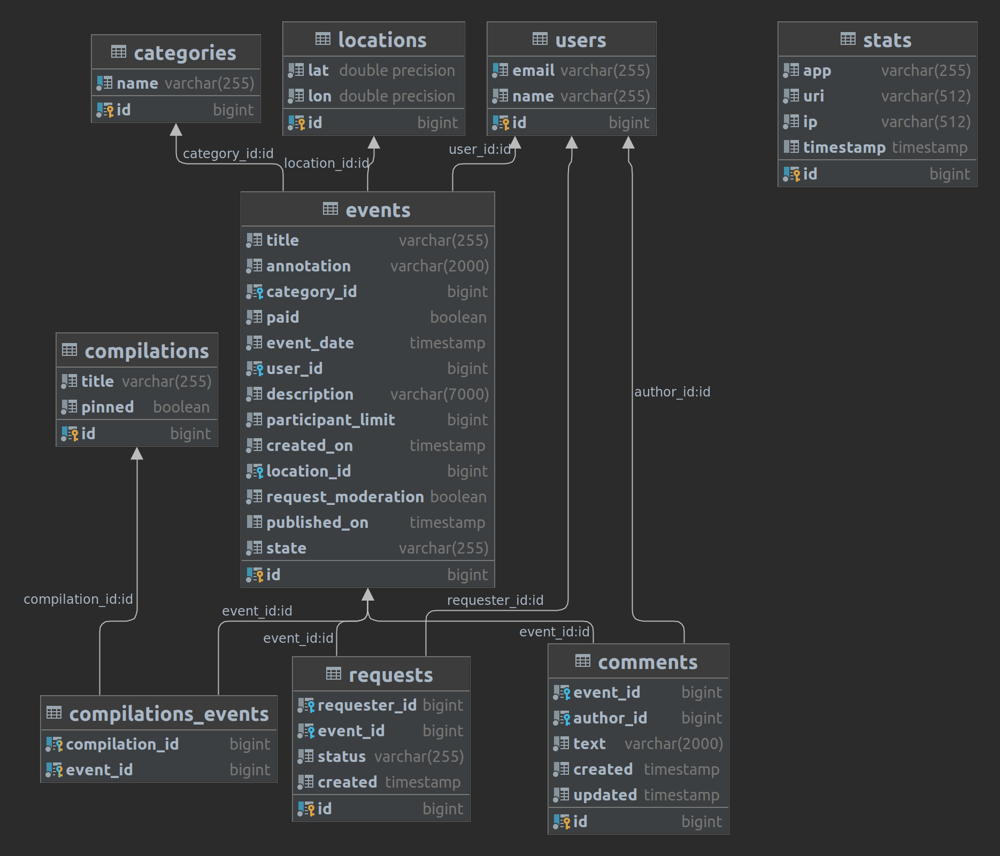

Приложение написано на Java 11, имеет микросервисную архитектуру. Разработка построена на принципах REST API, использованы PostgreSQL, Hibernate ORM, Lombok, Docker.

Это приложение — афиша, она помогает выбрать куда и с кем сходить. В этой афише можно предложить какое-либо событие от выставки до похода в кино и собрать компанию для участия в нём, а также обсудить это в комментариях.

### Диаграмма основной БД сервиса:

#### Варианты запуска приложения:
Командой «docker-compose up» (Для запуска через докер);
Запустить модули:
- «main»: main/src/main/java/ru/practicum/main/ExploreWithMeMain -> "run";
- «stats»: stats/service/src/main/java/ru/practicum/service/ExploreWithMeStats -> "run".